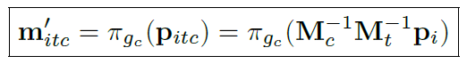
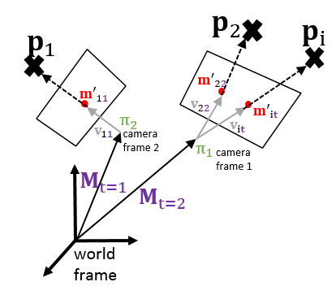
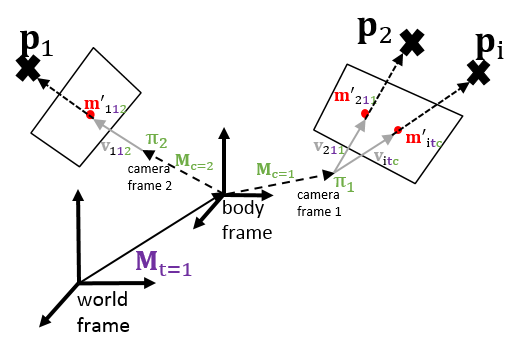
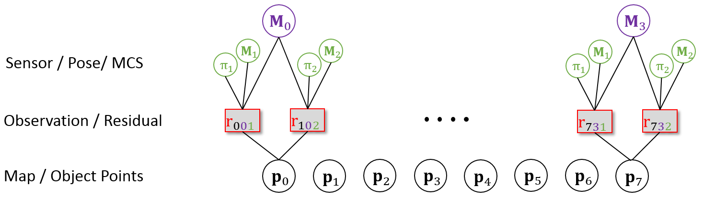

# !!!!This is an early version of MultiCol-SLAM!!!!

# MultiCol-SLAM
**Author**: [Steffen Urban](http://www.ipf.kit.edu/english/staff_urban_steffen.php) (urbste at googlemail.com).

MultiCol-SLAM is a multi-fisheye camera SLAM system.
We adapt the SLAM system proposed in [ORB-SLAM](https://github.com/raulmur/ORB_SLAM) and [ORB-SLAM2](https://github.com/raulmur/ORB_SLAM2) and extend it for the use with fisheye and multi-fisheye camera systems.

The novel methods and concepts included in this new version are:

- MultiKeyframes
- Generic camera model (Scaramuzza's polynomial model).
- MultiCol - a generic method for bundle adjustment for multi-camera systems.
- a hyper graph (g2o) formulation of MultiCol
- dBRIEF and mdBRIEF a distorted and a online learned, masked version of BRIEF.
- Multi-camera loop closing

A **paper** of the proposed SLAM system will follow.
Here some short descriptions on how the multi-camera integration works. 

The MultiCol model is explained extensively in the paper given below.
Here we briefly recapitulate the content:
The MultiCol model is given by:

the indices are **i** object point, **t** observed at time t, **c** in camera c.
The camera projection is given by \pi and we chose a general projection function, making this
model applicable for a varity of prevalent (central) cameras, like perspective, fisheye and omnidirectional.

For a single camera, we could omit the matrix M_t. 
This yields the classic collinearity equations. 
This is depicted in the following figure.
Each observation m' has two indices, i.e. **t** and **i**.

To handle multi-camera systems, the body frame is introduced, i.e. a frame that describes
the motion of the multi-camera rig:

If we are optimizing the exterior orientation of our multi-camera system, we are actually looking for
an estimate of matrix M_t.
Now each observation has three indices.

The graphical representation of MultiCol can be realized in a hyper-graph and g2o can be used to optimize vertices of this graph:

# 1. Related Publications:
    @Article{UrbanMultiCol2016,
      Title = {{MultiCol Bundle Adjustment: A Generic Method for Pose Estimation, Simultaneous Self-Calibration and Reconstruction for Arbitrary Multi-Camera Systems}},
      Author = {Urban, Steffen and Wursthorn, Sven and Leitloff, Jens and Hinz, Stefan},
      Journal = International Journal of Computer Vision,
      Year = {2016},
      Pages = {1--19}
     }
    @Article{urban2015improved,
      Title = {{Improved Wide-Angle, Fisheye and Omnidirectional Camera Calibration}},
      Author = {Urban, Steffen and Leitloff, Jens and Hinz, Stefan},
      Journal = {ISPRS Journal of Photogrammetry and Remote Sensing},
      Year = {2015},
      Pages = {72--79},
      Volume = {108},
      Publisher = {Elsevier},
    }

# 2. Requirements

- C++11 compiler

- As the accuracy and speed of the SLAM system also depend on the hardware, we advice you to run the system on a strong CPU.
We mainly tested the system using a laptop with i7-3630QM @2.4GHz and 16 GB of RAM running Win 7 x64.
So anything above that should be fine.

# 3. Camera calibration
  
We use a rather generic camera model, and thus MultiCol-SLAM should work with any prevalent central camera.
To calibrate your cameras follow the instructions on 
[link](https://github.com/urbste/ImprovedOcamCalib).
The systems expects a calibration file with the following structure:

    # Camera Parameters. Adjust them!
    # Camera calibration parameters camera back
    Camera.Iw: 754
    Camera.Ih: 480

    # hyperparameters
    Camera.nrpol: 5
    Camera.nrinvpol: 12

    # forward polynomial f(\rho)
    Camera.a0: -209.200757992065
    Camera.a1: 0.0 
    Camera.a2: 0.00213741670953883
    Camera.a3: -4.2203617319086e-06
    Camera.a4: 1.77146086919594e-08

    # backward polynomial rho(\theta)
    Camera.pol0: 293.667187375663
    .... and the rest pol1-pol10
    Camera.pol11: 0.810799620714366

    # affine matrix
    Camera.c: 0.999626131079017
    Camera.d: -0.0034775192597376
    Camera.e: 0.00385134991673147

    # principal point
    Camera.u0: 392.219508388648
    Camera.v0: 243.494438476351

You can find example files in ./Examples/Lafida

# 4. Multi-camera calibration

You can find example files in ./Examples/Lafida

# 5.Dependencies:

## Pangolin
For visualization.
Get the instructions here: [Pangolin](https://github.com/stevenlovegrove/Pangolin)

## OpenCV 3
Required is at least **OpenCV 3.0**. The library can be found at: [OpenCV](https://github.com/opencv/opencv).

## Eigen 3
Required by g2o. Version 3.2.9 is included in the ./ThirdParty folder. Other version can be found at [Eigen](http://eigen.tuxfamily.org/index.php?title=Main_Page).

## OpenGV
OpenGV can be found at: [OpenGV](https://github.com/laurentkneip/opengv).
It is also included in the ./ThirdParty folder.
We use OpenGV for re-localization (GP3P) and relative orientation estimation during initialization (Stewenius).

## DBoW2 and g2o
As ORB-SLAM2 we use modified versions of DBoW2 and g2o for place recognition and optimization respectively.
Both are included in the ./ThirdParty folder.
The original versions can be found here: [DBoW2](https://github.com/dorian3d/DBoW2), [g2o](https://github.com/RainerKuemmerle/g2o).

# 6. Build MultiCol-SLAM:

## Ubuntu:

This is tested with Ubuntu 16.04.
Before you build MultiCol-SLAM, you have to build and install OpenCV and Pangolin.
This can for example be done by running the following:

#### Build Pangolin:

    sudo apt-get install libglew-dev cmake
    git clone https://github.com/stevenlovegrove/Pangolin.git
    cd Pangolin
    mkdir build
    cd build
    cmake -DCPP11_NO_BOOST=1 ..
    make -j

#### Build OpenCV 3.1
This is just a suggestion on how to build OpenCV 3.1. There a plenty of options. Also some packages might be optional.

    sudo apt-get install libgtk2.0-dev pkg-config libavcodec-dev libavformat-dev libswscale-dev python-dev python-numpy libtbb2 libtbb-dev libjpeg-dev libpng-dev libtiff-dev libjasper-dev libdc1394-22-dev
    git clone https://github.com/Itseez/opencv.git
    cd opencv
    mkdir build
    cd build
    cmake -D CMAKE_BUILD_TYPE=RELEASE -D WITH_CUDA=OFF ..
    make -j
    sudo make install
this will take some time...

#### Build MultiCol-SLAM
    git clone https://github.com/urbste/MultiCol-SLAM.git MultiCol-SLAM
    cd MultiCol-SLAM
    chmod +x build.sh
    ./build.sh

for the rest run the build.sh
This will create a library and an executable **multi\_col\_slam\_lafida**, that you can run as shown in 7. below.

## Windows:
Required is at least Visual Studio 2013.

The first step is to build Pangolin

Then you have to build the third party libraries g2o,DBoW2, OpenGV

# 7. Run examples

By now you should have compiled all libraries and MultiCol-SLAM. If everthing went well, you will find an executable in the folder ./Examples/Lafida/Release if you are running Windows and ./

## [Lafida](http://www.ipf.kit.edu/lafida.php)
First download the indoor dynamic dataset: [dataset](http://www2.ipf.kit.edu/~pcv2016/downloads/indoor_dynamic.zip)
Then extract the folder, e.g. to the folder 

    $HOME$/Downloads/IndoorDynamic
    
The executable **multi\_col\_slam\_lafida** expects 4 paths. 
The first is the path to the vocabulary file.
The second is the path to the settings file.
The third is the path to the calibration files.
The fourth is the path to the images.
In our example, we could run MultiCol-SLAM:

    ./Examples/Lafida/multi_col_slam_lafida ./Examples/small_orb_omni_voc_9_6.yml  ./Examples/Lafida/Slam_Settings_indoor1.yaml ./Examples/Lafida/ $HOME$/Downloads/IndoorDynamic

